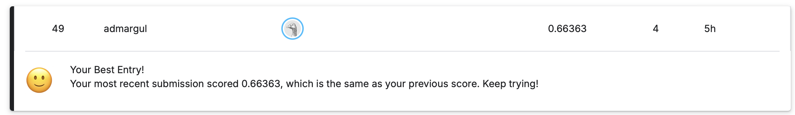

# CSE 144 Final Project

This repository contains my code for the UCSC CSE 144 Spring 2026 Transfer Learning Challenge. The model is a fine-tuned Vision Transformer used to classify test images into labels `0` through `99` and generate a Kaggle submission CSV.

## Repository Layout

The code should be organized as follows:

```text
.
├── README.md
├── requirements.txt
├── train.py
├── predict.py
├── report.pdf
├── leaderboard.png
├── src/
│   ├── config.py
│   ├── data.py
│   ├── engine.py
│   ├── model.py
│   ├── transforms.py
│   └── utils.py
├── data/
│   └── ucsc-cse-144-spring-2026-final-project/
│       ├── train/
│       ├── test/
│       └── sample_submission.csv
└── outputs/
    └── best_vit_ft.pth
```

The dataset should be placed in:

```text
data/ucsc-cse-144-spring-2026-final-project/
```

The provided trained model checkpoint should be placed in:

```text
outputs/best_vit_ft.pth
```

Trained model weights Google Drive link:

```text
TODO: paste Google Drive link here
```

## Setup

Install the required packages from the repository root:

```bash
pip install -r requirements.txt
```

## Run Training

To train the model from the repository root, run:

```bash
python train.py
```

This trains a pretrained ViT-B/16 model in two stages:

1. Frozen training: the ViT backbone is frozen and only the new 100-class classifier head is trained.
2. Fine-tuning: the classifier head and the last two ViT encoder blocks are trained.

Training checkpoints are saved in the `outputs/` directory. The best fine-tuned checkpoint is saved as:

```text
outputs/best_vit_ft.pth
```

## Run Inference with the Provided Model

To generate predictions using the provided trained model, first make sure the checkpoint is located at:

```text
outputs/best_vit_ft.pth
```

Then run:

```bash
python predict.py
```

This loads `outputs/best_vit_ft.pth`, runs inference on the test images, applies horizontal-flip test-time augmentation, and writes the Kaggle submission file to:

```text
outputs/submission_vit.csv
```

Submit `outputs/submission_vit.csv` to Kaggle.

## Kaggle Leaderboard Screenshot

The Kaggle leaderboard screenshot is shown below:



## Trained Model Weights

Google drive link to trained model checkpoint:
(https://drive.google.com/file/d/1Mku5DklUO9cXQFkIkzNo4mU2yWcofYDa/view?usp=sharing)

